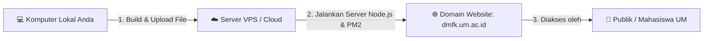

# 📘 Panduan Lengkap & Detail Operasional - DMFK UM Landing Page

Selamat datang! Dokumen ini disusun khusus agar Anda dapat memahami secara menyeluruh **cara kerja website DMFK UM**, **fitur-fitur yang telah dibuat**, dan **langkah demi langkah cara mempublikasikannya (Deploy) ke internet agar dapat diakses oleh publik**.

---

## 💡 Apa Itu "Deploy"? (Konsep Dasar)

Saat ini, website **DMFK UM** berjalan di komputer lokal Anda (Localhost). **"Deploy"** adalah proses memindahkan atau memasang program website ini ke sebuah **Server Cloud (VPS)** yang terhubung ke internet 24 jam nonstop, sehingga siapapun di seluruh dunia dapat membuka website ini melalui alamat domain seperti `dmfk.um.ac.id`.



---

## 🌟 Ringkasan Seluruh Fitur Website DMFK UM

Website ini dibangun menggunakan **Astro (Server-Side Rendering)** dan **Node.js** yang sangat cepat, responsif, dan hemat memori. Berikut adalah rincian fitur utama yang siap digunakan:

### 1. 🏠 Halaman Beranda (Homepage)
- **Banner Utama (Hero Banner)**: Menampilkan judul, sub-judul, dan latar belakang foto yang **dapat diubah langsung oleh Admin**.
- **Ringkasan Berita & Dokumen**: Menampilkan 3 Berita/Program Kerja terbaru dan 3 Dokumen Publik terpopuler secara otomatis dari database.

### 2. 📢 Halaman Program Kerja & Berita (`/proker`)
- **Berita & Pengumuman Resmi**: Menampilkan daftar berita lengkap dengan gambar sampul, tanggal, dan deskripsi.
- **Admin Modal**: Admin dapat menambah berita baru, mengedit berita lama, atau menghapus berita. Gambar lama yang tidak terpakai akan **otomatis terhapus dari server**.

### 3. 📁 Halaman Repositori Dokumen (`/repo`)
- **Pencarian & Filter Realtime**: Pengunjung dapat mengetik nama dokumen atau memilih kategori (seperti *AD/ART*, *SOP*, *Laporan Keuangan*) untuk menyaring dokumen secara instan.
- **Preview & Unduh**: Modal pratinjau dokumen dengan tombol unduh ikonik tanpa tulisan yang simpel.
- **Admin Modal**: Admin dapat mengunggah berkas PDF/Doc baru atau mengedit dokumen yang ada.

### 4. 🏛️ Halaman Profil Organisasi & Parlemen (`/profile`)
- **Visi & Misi**: Tampilan Visi & Misi interaktif yang dapat diedit Admin.
- **Hero Banner Parlemen**: Menampilkan **Wadah Logo Parlemen Berjalan**, **Badge Highlight Nama Parlemen** (*PARLEMEN NAWA CITA 2026*), dan foto latar belakang.
- **Bagan Struktur Organisasi Interaktif**:
  - **Pembina**: Nama, NIP, dan foto Pembina yang dapat diedit Admin.
  - **Presidium**: Ketua & Wakil dalam baris simetris yang menyesuaikan jumlah pengurus.
  - **Pengurus BPH**: Sekretaris & Bendahara dalam baris simetris.
  - **4 Komisi**: Kolom komisi berisi Ketua Komisi dan profil anggota tersusun ke bawah.
  - **Foto Setiap Personil**: Foto setiap pengurus dapat diunggah dari komputer atau URL.

### 5. 📞 Halaman Kontak & WhatsApp Direct (`/contact`)
- **Tautan WhatsApp Otomatis**: Menghubungkan pengunjung langsung ke WhatsApp Pengurus dengan draf pesan otomatis resmi (*"Halo DMFK UM, selamat [pagi/siang/sore]..."*) menggunakan format internasional `6281247562080`.
- **Informasi Sekretariat**: Email, Instagram, Linktree, dan alamat fisik yang dapat diubah via Admin.

---

## 🛠️ Langkah Demi Langkah Mempublikasikan Website (Deploy)

Berikut adalah panduan detail dari awal hingga akhir untuk mendeploy website ke **VPS (Virtual Private Server)** seperti DigitalOcean, Linode, Biznet, atau Server Kampus UM:

---

### 📍 Langkah 1: Persiapan Server (Kebutuhan Perangkat Lunak)

Masuk ke server VPS Anda via SSH melalui Terminal:
```bash
ssh root@ip-server-anda
```

Install Node.js (Versi 18 atau 20) di server VPS:
```bash
# Update paket Linux
sudo apt update && sudo apt upgrade -y

# Install Node.js v20
curl -fsSL https://deb.nodesource.com/setup_20.x | sudo -E bash -
sudo apt install -y nodejs

# Verifikasi versi Node.js
node -v # Harus muncul v20.x.x
```

---

### 📍 Langkah 2: Mengunggah Berkas Website ke Server

Ada 2 cara mengunggah berkas ke server:

#### Cara A: Menggunakan Git (Sangat Direkomendasikan)
1. Push project Anda ke GitHub / GitLab.
2. Di dalam server VPS, jalankan:
   ```bash
   git clone https://github.com/username/DMF-landingpage.git
   cd DMF-landingpage
   ```

#### Cara B: Mengunggah ZIP via FileZilla / SCP
1. Kompres folder project menjadi file `DMF-landingpage.zip` (tanpa folder `node_modules` dan `.astro`).
2. Unggah ke server VPS Anda dan ekstrak:
   ```bash
   unzip DMF-landingpage.zip
   cd DMF-landingpage
   ```

---

### 📍 Langkah 3: Install Dependensi & Build Aplikasi

Di dalam folder project pada server VPS, jalankan perintah berikut:

1. **Install seluruh library yang dibutuhkan**:
   ```bash
   npm install
   ```

2. **Kompilasi (Build) aplikasi untuk produksi**:
   ```bash
   npm run build
   ```
   *Perintah ini akan membuat folder `dist/` yang siap dijalankan dengan performa tinggi.*

---

### 📍 Langkah 4: Menjalankan Server 24 Jam dengan PM2

**PM2** adalah program manajer proses yang akan menjaga website Anda tetap menyala 24 jam nonstop di latar belakang server, dan otomatis menyala kembali jika server reboot.

1. **Install PM2 secara global**:
   ```bash
   npm install -g pm2
   ```

2. **Jalankan aplikasi DMFK UM**:
   ```bash
   PORT=4321 HOST=0.0.0.0 pm2 start dist/server/entry.mjs --name "dmfk-um-landing"
   ```

3. **Pastikan PM2 berjalan otomatis saat server booting**:
   ```bash
   pm2 save
   pm2 startup
   ```

---

### 📍 Langkah 5: Mengubungkan Domain & SSL Gratis (HTTPS)

Agar website dapat dibuka melalui nama domain seperti `dmfk.um.ac.id`, gunakan **Nginx** sebagai Reverse Proxy:

1. **Install Nginx**:
   ```bash
   sudo apt install -y nginx
   ```

2. **Buat file konfigurasi Nginx**:
   ```bash
   sudo nano /etc/nginx/sites-available/dmfk-um
   ```

3. **Tempelkan (Paste) konfigurasi berikut**:
   ```nginx
   server {
       listen 80;
       server_name dmfk.um.ac.id; # Ganti dengan nama domain Anda

       client_max_body_size 50M; # Memungkinkan upload file PDF/Gambar besar

       location / {
           proxy_pass http://127.0.0.1:4321;
           proxy_http_version 1.1;
           proxy_set_header Upgrade $http_upgrade;
           proxy_set_header Connection 'upgrade';
           proxy_set_header Host $host;
           proxy_cache_bypass $http_upgrade;
           proxy_set_header X-Real-IP $remote_addr;
           proxy_set_header X-Forwarded-For $proxy_add_x_forwarded_for;
       }
   }
   ```

4. **Aktifkan konfigurasi dan reload Nginx**:
   ```bash
   sudo ln -s /etc/nginx/sites-available/dmfk-um /etc/nginx/sites-enabled/
   sudo nginx -t
   sudo systemctl reload nginx
   ```

5. **Pasang Sertifikat Keamanan SSL (HTTPS / Gembok Hijau)**:
   ```bash
   sudo apt install -y certbot python3-certbot-nginx
   sudo certbot --nginx -d dmfk.um.ac.id
   ```

---

## 🔐 Cara Login & Mengelola Website Sebagai Admin

Setelah website aktif di internet:
1. Buka website di browser (contoh: `https://dmfk.um.ac.id`).
2. Buka Console Browser (Tekan `F12` -> pilih tab **Console**).
3. Ketik perintah berikut lalu tekan Enter untuk masuk Mode Admin:
   ```javascript
   localStorage.setItem('isAdmin', 'true'); location.reload();
   ```
4. Tombol-tombol pengeditan berwarna merah (*Edit Hero, Edit Visi & Misi, Kelola Bagan Organisasi, Edit Banner & Parlemen, Tambah Berita, Tambah Dokumen*) akan langsung muncul!
5. Untuk keluar dari Mode Admin:
   ```javascript
   localStorage.removeItem('isAdmin'); location.reload();
   ```

---

## ❓ Pertanyaan Yang Sering Diajukan (FAQ)

### Q: Apakah data gambar yang diunggah akan aman dan tidak membuat memori server penuh?
**A:** Ya! Sistem API website ini telah dilengkapi dengan **Global Automatic Cleanup**. Setiap kali Admin mengganti foto banner, foto pengurus, atau menghapus berita/dokumen, **file lama akan otomatis terhapus fisik dari server disk**.

### Q: Jika saya mengubah isi Visi, Misi, atau Bagan Organisasi, apakah data akan ter-reset jika server direstart?
**A:** Tidak! Seluruh data tersimpan secara permanen dalam file database JSON (`database/settings.json`, `database/news.json`, `database/docs.json`) di disk server.

---

Dengan panduan ini, website DMFK UM siap untuk dipublikasikan dan dikelola dengan mudah! 🚀
