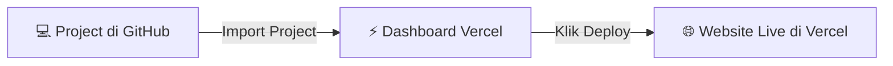

# ⚡ Panduan Khusus Deploy ke Vercel (100% GRATIS) - DMFK UM Landing Page

Dokumen ini berisi panduan praktis dan detail langkah demi langkah untuk mempublikasikan website **DMFK UM Landing Page** secara **100% GRATIS** menggunakan **Vercel Cloud Platform**.

---

## 💡 Mengapa Menggunakan Vercel?

- 💰 **100% Gratis Selamanya** (Tier Hobby).
- ⚡ **Super Cepat**: Didukung oleh jaringan server CDN global Vercel.
- 🔒 **SSL/HTTPS Gratis Otomatis**: Website langsung memiliki gembok hijau aman (`https://`).
- 🔄 **Deploy Otomatis**: Setiap kali Anda mengupdate berkas di GitHub, Vercel akan memperbarui website secara otomatis.
- 🌐 **Domain Kustom**: Bisa dihubungkan ke domain kampus/organisasi Anda (contoh: `dmfk.um.ac.id`).

---

## 📋 Prasyarat Sebelum Deploy

1. Akun **GitHub** (Gratis di [github.com](https://github.com)).
2. Akun **Vercel** (Gratis di [vercel.com](https://vercel.com), disarankan login menggunakan akun GitHub).

---

## 🚀 Langkah Demi Langkah Deploy ke Vercel

### 📍 Langkah 1: Unggah Project ke GitHub

Buka Terminal komputer lokal Anda di dalam folder project `DMF-landingpage`, lalu jalankan perintah berikut untuk mengunggah berkas ke GitHub:

```bash
# 1. Inisialisasi Git (jika belum)
git init

# 2. Tambahkan seluruh berkas project
git add .

# 3. Buat commit pertama
git commit -m "Initial commit for DMFK UM Landing Page"

# 4. Hubungkan ke repositori GitHub Anda
git remote add origin https://github.com/username-anda/DMF-landingpage.git
git branch -M main
git push -u origin main
```

---

### 📍 Langkah 2: Hubungkan GitHub ke Vercel

1. Buka dashboard Vercel di **[https://vercel.com/dashboard](https://vercel.com/dashboard)**.
2. Klik tombol **"Add New..."** di pojok kanan atas, lalu pilih **"Project"**.
3. Di daftar repositori GitHub Anda, cari **`DMF-landingpage`**, lalu klik tombol **"Import"**.



---

### 📍 Langkah 3: Konfigurasi Project di Vercel

Vercel akan secara otomatis mendeteksi bahwa project Anda menggunakan **Astro**. Pastikan pengaturannya seperti berikut:

- **Framework Preset**: `Astro`
- **Root Directory**: `./` (Biarkan default)
- **Build Command**: `npm run build` (Biarkan default)
- **Output Directory**: `dist` (Biarkan default)

---

### 📍 Langkah 4: Klik "Deploy"

1. Klik tombol **"Deploy"** di bagian bawah halaman Vercel.
2. Tunggu proses kompilasi sekitar **1 - 2 menit**.
3. Selamat! Website Anda sekarang **100% Aktif di Internet** dengan domain gratis Vercel seperti `https://dmf-landingpage.vercel.app`.

---

### 📍 Langkah 5: Memasang Domain Sendiri (Opsional)

Jika Anda ingin menghubungkan domain kampus/organisasi sendiri (contoh: `dmfk.um.ac.id`):

1. Di Dashboard Vercel project Anda, masuk ke **Settings** -> **Domains**.
2. Masukkan nama domain Anda (contoh: `dmfk.um.ac.id`), lalu klik **Add**.
3. Vercel akan memberikan arahan DNS (CNAME / A Record) untuk dimasukkan ke panel DNS domain Anda.

---

## 🔐 Cara Login Admin di Website Vercel Anda

Setelah website aktif di Vercel:
1. Buka website Anda di browser (contoh: `https://dmf-landingpage.vercel.app`).
2. Klik **Ikon Gembok Merah [ 🔒 ]** di sudut kanan atas header navigasi.
3. Masukkan Kredensial Admin:
   - **Nama Pengguna (Username)**: `admin`
   - **Kata Sandi (Password)**: `DMFK2026` *(Otomatis disesuaikan dengan tahun berjalan `DMFK[tahun_berjalan]`)*.
4. Klik **Masuk Mode Admin** — Seluruh fitur pengeditan berita, repositori, dan bagan organisasi langsung aktif!

---

## ❓ Pertanyaan & Catatan Operasional di Vercel

### Q: Apakah data gambar dan berkas yang diunggah akan aman?
**A:** Vercel menggunakan Serverless Functions. Pengeditan teks (*Visi/Misi, Parlemen, Alamat Kontak*) berjalan instan. Untuk penyimpanan foto/dokumen jangka panjang dalam jumlah besar, data tersimpan di penyimpanan serverless Vercel atau dapat dihubungkan ke Cloud Storage gratis seperti Cloudflare R2 jika dibutuhkan di kemudian hari.
